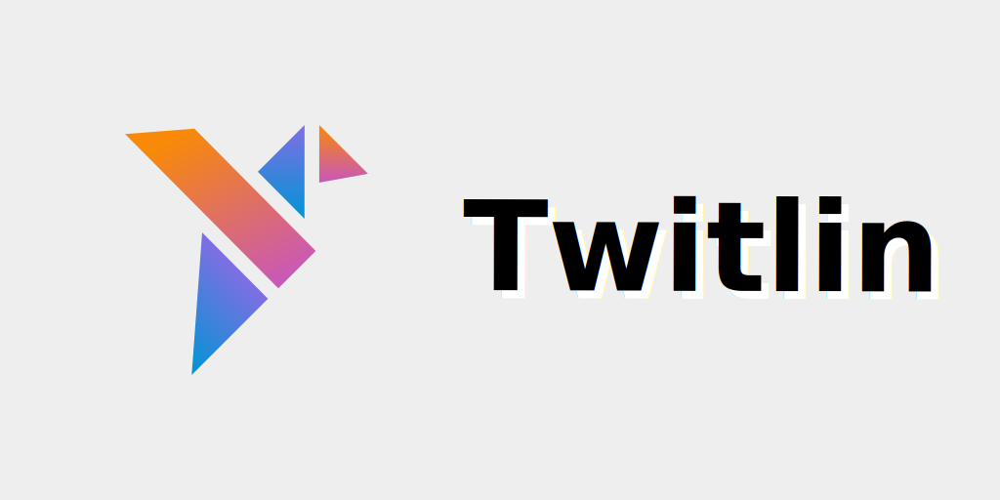

このプロジェクトは、TwitterAPIを使用できるようにするKotlinマルチプラットフォームライブラリです。

現在 `jvm`, `android`, `js` をサポートしています。

まだ `ios`, `native` はサポートしていませんがその予定はあります。

### ダウンロード

#### リポジトリ

このライブラリは、jCenterまたはmavenリポジトリからダウンロードできます。

TwitlinはTwitter API のフルKotlin製ラッパーライブラリです。 Kotlin特性を最大限活用した。書き方ができます。

